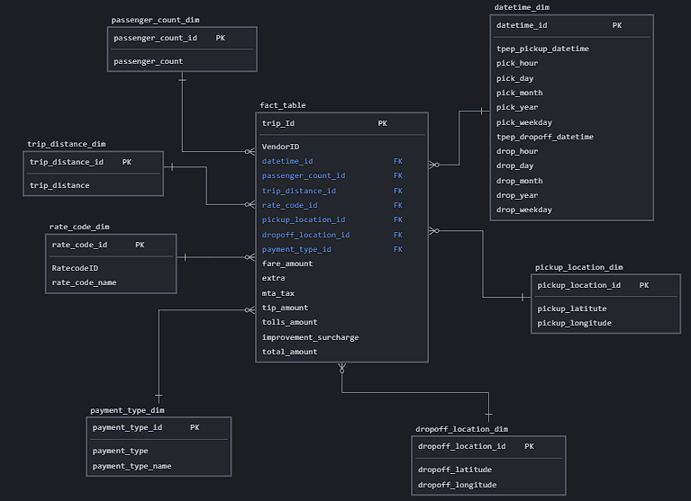

# Uber Data Analytics | Data Engineering GCP Project

## Introduction

The goal of this project is to perform data analytics on Uber data using various tools and technologies, including GCP Storage, Python, Compute Instance, Mage Data Pipeline Tool, BigQuery, and Looker Studio.

## Architecture 

## Technology Used
- Programming Language - Python

Google Cloud Platform
1. Google Storage
2. Compute Instance 
3. BigQuery
4. Looker Studio

Modern Data Pipeine Tool - https://www.mage.ai/

## Dataset Used
TLC Trip Record Data
Yellow and green taxi trip records include fields capturing pick-up and drop-off dates/times, pick-up and drop-off locations, trip distances, itemized fares, rate types, payment types, and driver-reported passenger counts. 

[Dataset Link](https://github.com/iM7d4/Uber-Data-Analytics---Data-Engineering-GCP-Project/blob/main/data/uber_data.csv)  
[Dataset Source](https://www.nyc.gov/site/tlc/about/tlc-trip-record-data.page)  
[Data Dictionary](https://www.nyc.gov/assets/tlc/downloads/pdf/data_dictionary_trip_records_yellow.pdf)

## Data Model

## Steps Followed
I've implemented the following action plan: 
	1. Data Modelling: Used a snowflake schema and derived multiple Dimensional tables connected to one Fact table.
	2. Data Transformation : In a local notebook, I transformed the dataset according to the data model prepared to create the suitable Dimensional and Fact Tables after cleaning the data. [Data Transformation Code](https://github.com/iM7d4/Uber-Data-Analytics---Data-Engineering-GCP-Project/blob/main/Uber%20Data%20Pipeline.ipynb)
	3. Google Cloud: 
		a. Google Storage : Stored the original dataset into the bucket for easy access via a public link.
		b. Compute Engine : Created a E2 Series Standard Computer Instance with HTTP requests enabled under Firewall. We can easily connect to the instance by clicking on the "SSH" Button. To install everything to be used on the instance, we run the relevant commands. [List of Commands](https://github.com/iM7d4/Uber-Data-Analytics---Data-Engineering-GCP-Project/blob/main/commands.txt)
		c. Mage Pipeline : Implemented the ETL process where data is extracted from Google Storage which is then transformed as per the requriement (Refer Step 2). This transformed data is then loaded into BigQuery for analytics. [Mage Files](https://github.com/iM7d4/Uber-Data-Analytics---Data-Engineering-GCP-Project/tree/main/mage-files)
		d. BigQuery: Using SQL to extract any insights required. [Example](https://github.com/iM7d4/Uber-Data-Analytics---Data-Engineering-GCP-Project/blob/main/Analysis_queries.sql)
		e. Looker Studio: Visualization of the required insights. [Example](https://github.com/iM7d4/Uber-Data-Analytics---Data-Engineering-GCP-Project/blob/main/Visualization.png)
												

